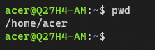
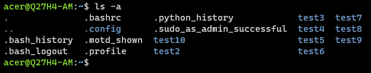
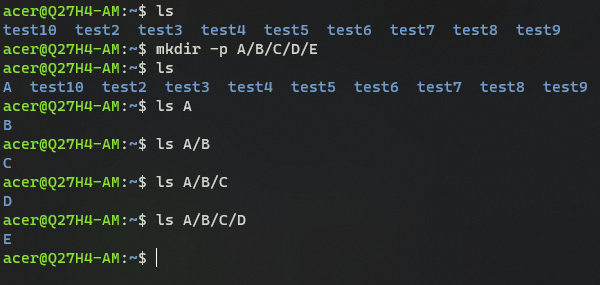

Day 2 Task Solution: Basics linux command

1. To Check your present working directory.

```bash
pwd
```



2. List all the files or directories including hidden files.

```bash
ls -a
```




3. 3. Create a nested directory A/B/C/D/E

```bash
mkdir -p A/B/C/D/E
```

