Day 3 Task Solution: Basic Linux Commands

1. To view what's written in a file.

```bash
cat test.txt
```

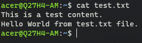

2. To change the access permissions of files.

```bash
chmod 777 test.txt
```

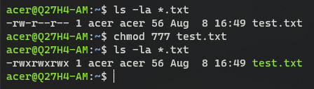

3. To check which commands you have run till now.

```bash
history
```

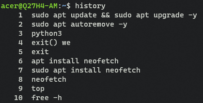

4. To remove a directory/ Folder.

```bash
rmdir -r test2
    or
rm -r test2
```

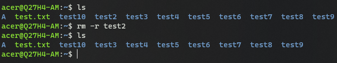

5. To create a fruits.txt file and to view the content.

To create a fruits.txt
```bash
touch fruits.txt
    or
vim fruits.txt
```

To view fruits.txt content
```bash
cat fruits.txt
```

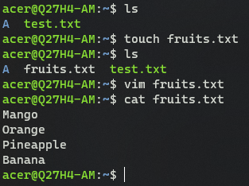

6. Add content in devops.txt (One in each line) - Apple, Mango, Banana, Cherry, Kiwi, Orange, Guava.

Make a devops.txt file using vim. It will let use make a new file and open it to insert the content one by one by using "insert mode". Then press "esc" key and ":wq" to write and quit the file.
```bash
vim devops.txt
```

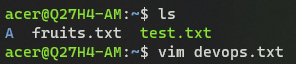

7. To Show only top three fruits from the file.

```bash
head -3 fruits.txt
```

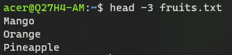

8. To Show only bottom three fruits from the file.

```bash
tail -3 fruits.txt 
```

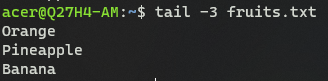

9. To create another file Colors.txt and to view the content.

To create a Colors.txt
```bash
touch Colors.txt
    or
vim Colors.txt
```

To view Colors.txt content
```bash
cat Colors.txt
```

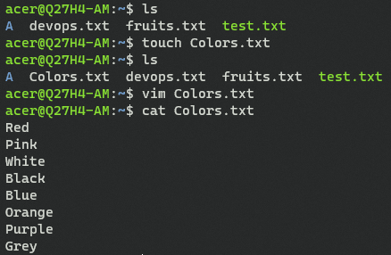

10. Add content in Colors.txt (One in each line) - Red, Pink, White, Black, Blue, Orange, Purple, Grey.

Make a devops.txt file using vim. It will let use make a new file and open it to insert the content one by one by using "insert mode". Then press "esc" key and ":wq" to write and quit the file.

```bash
vim Colors.txt
```

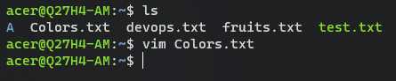


11. To find the difference between fruits.txt and Colors.txt file.

```bash
diff fruits.txt Colors.txt
```

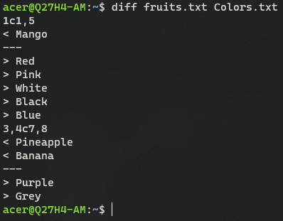