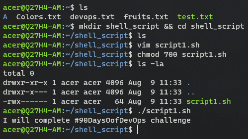
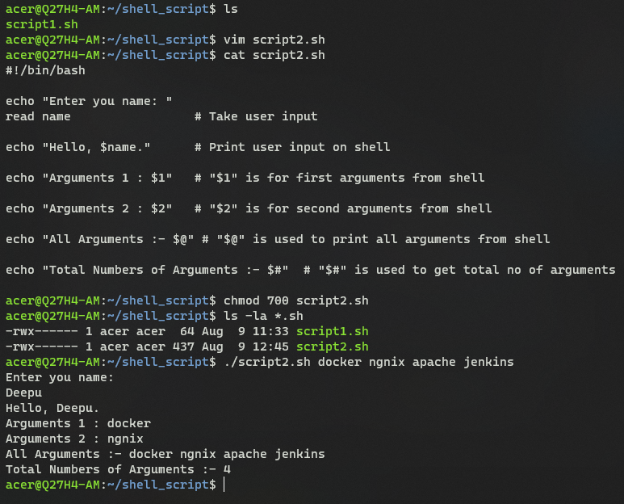
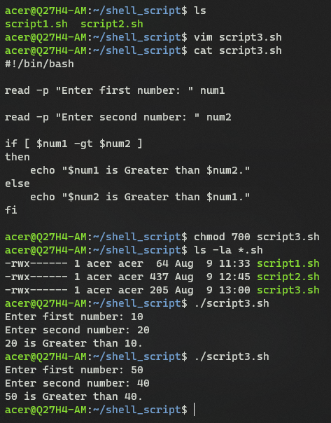

Day 4 Task Solution: Basic Linux Shell Scripting for DevOps Engineers.

Q.1:- Explain in your own words and examples, what is Shell Scripting for DevOps ?

Ans:- Shell scripting for DevOps is like teaching your computer to perform tasks on its own using a series of pre-written commands. It saves time, reduces mistakes, and makes your digital life more organized and efficient.

For example, sending messages or notifications. Instead of typing the same message to multiple people every time, you could write a shell script that sends the message to all the recipients with just one command. Taking Database Backup, Performing some task daily at same interval of time, etc.

Q.2:- What is #!/bin/bash? can we write #!/bin/sh as well ?

Ans:- Yes, We can use both `#!/bin/bash` and `#!/bin/sh` are called shebang lines, and they are used at the beginning of a shell script to indicate which shell interpreter should be used to run the script.

1. `#!/bin/bash`: This shebang line tells the system to use the "bash" shell interpreter to execute the script. Bash (Bourne Again SHell) is a popular and powerful shell with advanced features, often used in various scripting tasks.

2. `#!/bin/sh`: This shebang line tells the system to use the default system shell interpreter to run the script. In most Unix-like systems, this points to the "sh" shell, which is a simpler and more basic shell compared to Bash. It's guaranteed to be available on most systems, making it a good choice for simple and portable scripts.

So, both `#!/bin/bash` and `#!/bin/sh` indicate which shell interpreter to use for executing the script. You choose between them based on the features you need and the compatibility you want for your script.

Q.3:- Write a Shell Script which prints `I will complete #90DaysOofDevOps challenge`

Ans:- 

```
#!/bin/bash

echo "I will complete #90DaysOofDevOps challenge"
```



Q.4:- Write a Shell Script to take user input, input from arguments and print the variables?

Ans:-

```
#!/bin/bash

echo "Enter you name: "
read name                 # Take user input

echo "Hello, $name."      # Print user input on shell

echo "Arguments 1 : $1"   # "$1" is for first arguments from shell

echo "Arguments 2 : $2"   # "$2" is for second arguments from shell

echo "All Arguments :- $@" # "$@" is used to print all arguments from shell

echo "Total Numbers of Arguments :- $#"  # "$#" is used to get total no of arguments
```




Q.5:- Write an Example of If else in Shell Scripting by comparing 2 numbers?

Ans:- 

```
#!/bin/bash

read -p "Enter first number: " num1

read -p "Enter second number: " num2

if [ $num1 -gt $num2 ]
then
    echo "$num1 is Greater than $num2."
else
    echo "$num2 is Greater than $num1."
fi
```

